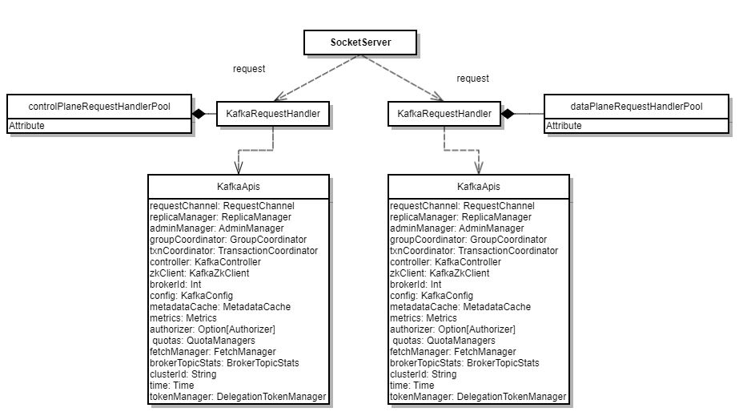

# kafka


Kafka是一个开源的由scala语言写的分布式消息系统，最初是LinkedLIn公司设计的分布式提交日志系，之后成为了Apache的一部分。特性：

可扩展：水平热扩展

高吞吐，低延迟：消息顺序读写，zero-copy系统调用，topic->partition->segment file（数据分区，并行处理），message批处理压缩发送, 充分利用page cache提高IO效率

持久性：消息存磁盘并支持多副本

容错性：允许节点失败

高并发：支持多用户同时读写

## 基本结构

Producer:向kafka broker发送消息

Consumer:从kafka broker取消息

Topic: 一个消息队列，每个topic可以分布在多个broker上

Partition: 当topic很大时，topic可以被分成很多个partition, partition内部是个有序队列，每条消息都会有个有序的id，kafka只保证partition内部消息能有序发送给consumer,不保证topic能整体有序

Broker:单个kafkaServer节点，一个broker可以包含多个topic

## 请求处理流程



请求类型：

```
  /**
   * Top-level method that handles all requests and multiplexes to the right api
   */
  def handle(request: RequestChannel.Request) {
    try {
      trace(s"Handling request:${request.requestDesc(true)} from connection ${request.context.connectionId};" +
        s"securityProtocol:${request.context.securityProtocol},principal:${request.context.principal}")
      request.header.apiKey match {
        case ApiKeys.PRODUCE => handleProduceRequest(request)
        case ApiKeys.FETCH => handleFetchRequest(request)
        case ApiKeys.LIST_OFFSETS => handleListOffsetRequest(request)
        case ApiKeys.METADATA => handleTopicMetadataRequest(request)
        case ApiKeys.LEADER_AND_ISR => handleLeaderAndIsrRequest(request)
        case ApiKeys.STOP_REPLICA => handleStopReplicaRequest(request)
        case ApiKeys.UPDATE_METADATA => handleUpdateMetadataRequest(request)
        case ApiKeys.CONTROLLED_SHUTDOWN => handleControlledShutdownRequest(request)
        case ApiKeys.OFFSET_COMMIT => handleOffsetCommitRequest(request)
        case ApiKeys.OFFSET_FETCH => handleOffsetFetchRequest(request)
        case ApiKeys.FIND_COORDINATOR => handleFindCoordinatorRequest(request)
        case ApiKeys.JOIN_GROUP => handleJoinGroupRequest(request)
        case ApiKeys.HEARTBEAT => handleHeartbeatRequest(request)
        case ApiKeys.LEAVE_GROUP => handleLeaveGroupRequest(request)
        case ApiKeys.SYNC_GROUP => handleSyncGroupRequest(request)
        case ApiKeys.DESCRIBE_GROUPS => handleDescribeGroupRequest(request)
        case ApiKeys.LIST_GROUPS => handleListGroupsRequest(request)
        case ApiKeys.SASL_HANDSHAKE => handleSaslHandshakeRequest(request)
        case ApiKeys.API_VERSIONS => handleApiVersionsRequest(request)
        case ApiKeys.CREATE_TOPICS => handleCreateTopicsRequest(request)
        case ApiKeys.DELETE_TOPICS => handleDeleteTopicsRequest(request)
        case ApiKeys.DELETE_RECORDS => handleDeleteRecordsRequest(request)
        case ApiKeys.INIT_PRODUCER_ID => handleInitProducerIdRequest(request)
        case ApiKeys.OFFSET_FOR_LEADER_EPOCH => handleOffsetForLeaderEpochRequest(request)
        case ApiKeys.ADD_PARTITIONS_TO_TXN => handleAddPartitionToTxnRequest(request)
        case ApiKeys.ADD_OFFSETS_TO_TXN => handleAddOffsetsToTxnRequest(request)
        case ApiKeys.END_TXN => handleEndTxnRequest(request)
        case ApiKeys.WRITE_TXN_MARKERS => handleWriteTxnMarkersRequest(request)
        case ApiKeys.TXN_OFFSET_COMMIT => handleTxnOffsetCommitRequest(request)
        case ApiKeys.DESCRIBE_ACLS => handleDescribeAcls(request)
        case ApiKeys.CREATE_ACLS => handleCreateAcls(request)
        case ApiKeys.DELETE_ACLS => handleDeleteAcls(request)
        case ApiKeys.ALTER_CONFIGS => handleAlterConfigsRequest(request)
        case ApiKeys.DESCRIBE_CONFIGS => handleDescribeConfigsRequest(request)
        case ApiKeys.ALTER_REPLICA_LOG_DIRS => handleAlterReplicaLogDirsRequest(request)
        case ApiKeys.DESCRIBE_LOG_DIRS => handleDescribeLogDirsRequest(request)
        case ApiKeys.SASL_AUTHENTICATE => handleSaslAuthenticateRequest(request)
        case ApiKeys.CREATE_PARTITIONS => handleCreatePartitionsRequest(request)
        case ApiKeys.CREATE_DELEGATION_TOKEN => handleCreateTokenRequest(request)
        case ApiKeys.RENEW_DELEGATION_TOKEN => handleRenewTokenRequest(request)
        case ApiKeys.EXPIRE_DELEGATION_TOKEN => handleExpireTokenRequest(request)
        case ApiKeys.DESCRIBE_DELEGATION_TOKEN => handleDescribeTokensRequest(request)
        case ApiKeys.DELETE_GROUPS => handleDeleteGroupsRequest(request)
        case ApiKeys.ELECT_PREFERRED_LEADERS => handleElectPreferredReplicaLeader(request)
      }
    } catch {
      case e: FatalExitError => throw e
      case e: Throwable => handleError(request, e)
    } finally {
      request.apiLocalCompleteTimeNanos = time.nanoseconds
    }
  }
```
## Topic

### 创建流程


### 处理过程

